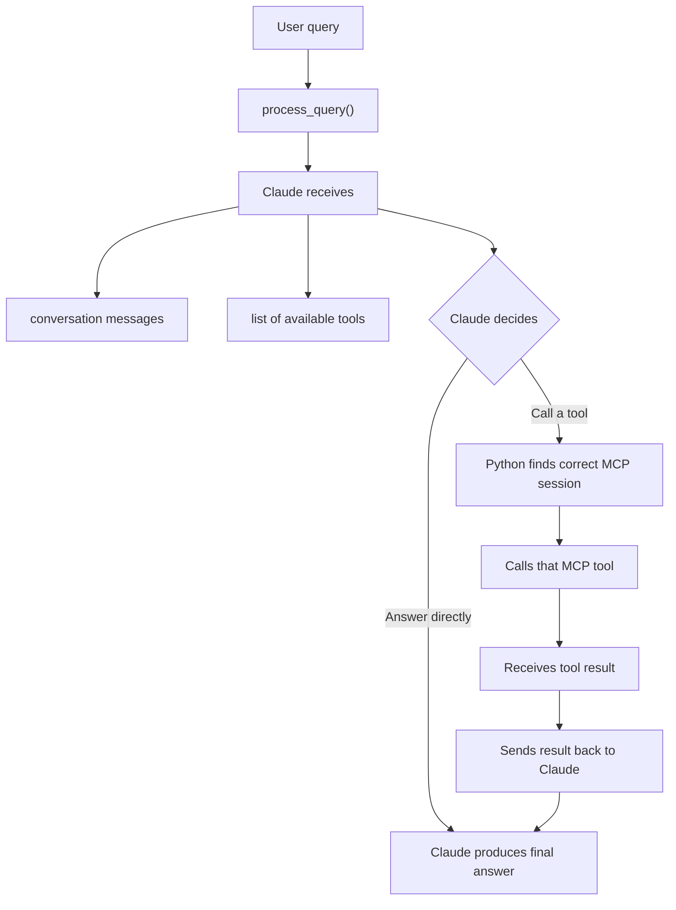

```mermaid
flowchart TD
    A["User query"] --> B["process_query()"]

    B --> C["Claude receives"]
    C --> C1["conversation messages"]
    C --> C2["list of available tools"]

    C --> D{"Claude decides"}

    D -->|Answer directly| E["Claude produces final answer"]

    D -->|Call a tool| F["Python finds correct MCP session"]
    F --> G["Calls that MCP tool"]
    G --> H["Receives tool result"]
    H --> I["Sends result back to Claude"]
    I --> E
```
