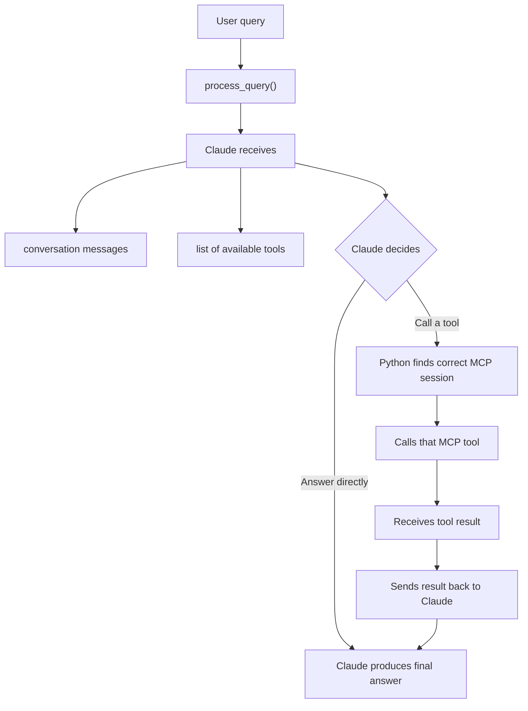
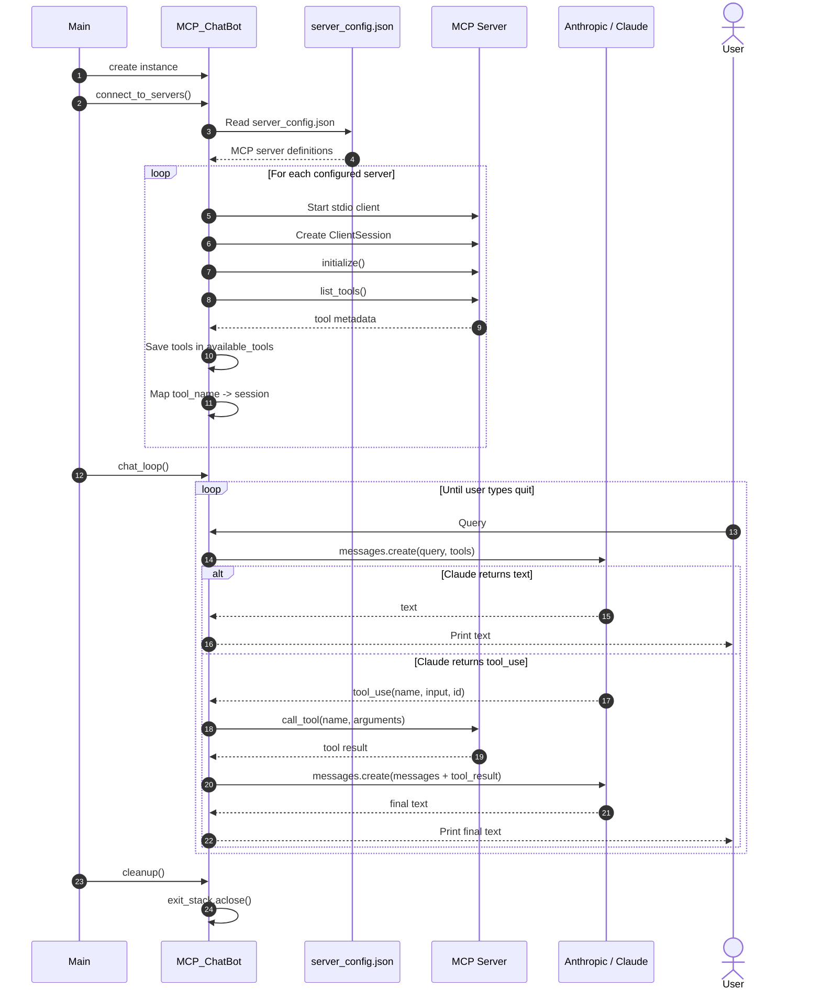

**High Level Logic**

```mermaid
flowchart TD
    A["User query"] --> B["process_query()"]

    B --> C["Claude receives"]
    C --> C1["conversation messages"]
    C --> C2["list of available tools"]

    C --> D{"Claude decides"}

    D -->|Answer directly| E["Claude produces final answer"]

    D -->|Call a tool| F["Python finds correct MCP session"]
    F --> G["Calls that MCP tool"]
    G --> H["Receives tool result"]
    H --> I["Sends result back to Claude"]
    I --> E
```

**Key Concepts**

```mermaid
sequenceDiagram
    autonumber
    participant Main
    participant Chatbot as MCP_ChatBot
    participant Config as server_config.json
    participant MCP as MCP Server
    participant Claude as Anthropic / Claude
    actor User

    Main->>Chatbot: create instance
    Main->>Chatbot: connect_to_servers()

    Chatbot->>Config: Read server_config.json
    Config-->>Chatbot: MCP server definitions

    loop For each configured server
        Chatbot->>MCP: Start stdio client
        Chatbot->>MCP: Create ClientSession
        Chatbot->>MCP: initialize()
        Chatbot->>MCP: list_tools()
        MCP-->>Chatbot: tool metadata
        Chatbot->>Chatbot: Save tools in available_tools
        Chatbot->>Chatbot: Map tool_name -> session
    end

    Main->>Chatbot: chat_loop()

    loop Until user types quit
        User->>Chatbot: Query
        Chatbot->>Claude: messages.create(query, tools)

        alt Claude returns text
            Claude-->>Chatbot: text
            Chatbot-->>User: Print text
        else Claude returns tool_use
            Claude-->>Chatbot: tool_use(name, input, id)
            Chatbot->>MCP: call_tool(name, arguments)
            MCP-->>Chatbot: tool result
            Chatbot->>Claude: messages.create(messages + tool_result)
            Claude-->>Chatbot: final text
            Chatbot-->>User: Print final text
        end
    end

    Main->>Chatbot: cleanup()
    Chatbot->>Chatbot: exit_stack.aclose()

```
