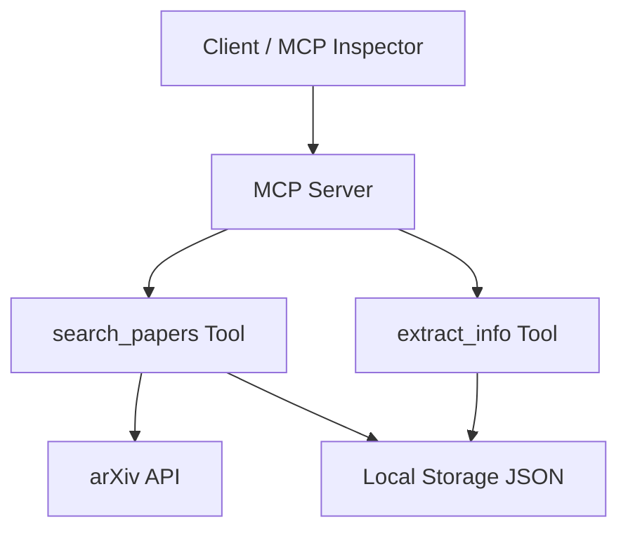

# 🧠 Model Context Protocol (MCP) — Simple Explanation
Because AI without data is just guessing confidently. 🤖✨


## What is MCP?

**MCP (Model Context Protocol)** is an open standard that defines how AI applications connect to external tools, data, and services.

> Think of MCP as a **universal connector (like USB)** for AI apps.

---

## 🏗️ Core Concept

MCP standardizes how an AI system:
- Accesses **tools** (functions/APIs)
- Reads **data** (files, databases, documents)
- Uses **prompt templates**

Instead of building custom integrations for each system, MCP provides a **common interface**.

---

## 🔄 Architecture: Client–Server Model

MCP uses a simple **client-server design**:

### 1️⃣ MCP Client (Inside Your AI App)
- Runs inside your chatbot or AI agent
- Sends requests to MCP servers
- Asks for tools or data

### 2️⃣ MCP Server (External Service)
- Provides capabilities to the AI:
  - ✅ Tools (functions the AI can call)
  - ✅ Data (files, APIs, knowledge sources)
  - ✅ Prompt templates

**Examples of MCP Servers:**
- GitHub server
- Google Drive server
- Local file system server

---

## 🔁 How It Works


User → AI App (MCP Client) → MCP Server → Tool/Data → Response → User

---

## 🚀 Why MCP Matters

# 🧠 Why MCP (Model Context Protocol) Matters

## 🚩 The Core Problem

> **"Models are only as good as the context provided to them."**

Even the most powerful AI model:
- ❌ Cannot access real-world data on its own  
- ❌ Cannot interact with systems (GitHub, CRM, files, etc.)  
- ❌ Becomes limited without external context  

👉 Example:
- A model cannot fetch GitHub issues unless you **connect it to GitHub**
- A model cannot assign tasks in Asana unless you **integrate it**

---

## ❌ Before MCP: Fragmented AI Development

Without MCP:

- Every AI app builds **custom integrations**:
  - GitHub → custom API logic
  - Google Drive → separate integration
  - CRM tools → another custom layer

- Leads to:
  - 🔁 Repeated work
  - 🧩 Fragmented systems
  - 🧱 Tight coupling between model and data source

---

## ✅ What MCP Solves

**MCP standardizes how AI applications connect to tools and data.**

> Instead of building integrations repeatedly → **build once, reuse everywhere**

---

## 🌐 MCP = Like REST for AI

MCP is similar to how **REST standardized web communication**:

| Concept | Web World | AI World |
|--------|----------|---------|
| Standard protocol | REST APIs | MCP |
| Communication | Client ↔ Server | AI ↔ Data/Tools |
| Goal | Interoperability | Interoperability |

👉 MCP ensures:
- All AI apps **"speak the same language"**
- Tools and data sources are **plug-and-play**

---

## 🧠 Key Idea

> Everything MCP does **can be done without MCP**, BUT...

Without MCP:
- You rebuild everything repeatedly

With MCP:
- You standardize once and scale easily

---

## 🔁 Real Example (From Demo)

### Scenario:
You want an AI agent to:
1. Read GitHub issues
2. Create tasks in Asana
3. Assign those tasks

---

### ✅ With MCP

- Connect to:
  - GitHub MCP server
  - Asana MCP server

Now:

- AI reads from GitHub ✅  
- AI writes to Asana ✅  
- AI assigns tasks ✅  

👉 All using **natural language**

---

## 🔄 Read + Write Across Systems

MCP enables workflows like:

---

## 🧠 Example Use Case

### ❌ Without MCP
To build a research assistant:
- Write GitHub integration
- Write Google Drive integration
- Handle file system access

👉 Lots of custom code

---

### ✅ With MCP
- Connect to:
  - GitHub MCP server
  - Google Drive MCP server
  - File system MCP server

👉 These servers:
- Define the tools
- Handle execution
- Return results

---

## 🧰 What MCP Servers Provide

### 🔧 Tools
Functions the AI can call  
Examples:
- `search_repo`
- `read_file`
- `summarize_document`

---

### 📂 Resources (Data)
- Documents
- Files
- Databases

---

### 🧾 Prompt Templates
Predefined prompts to guide AI behavior

---

## 🔁 Reusability

- Build an MCP server once ✅
- Use it across multiple apps ✅
- Connect it to tools like:
  - Chatbots
  - Claude Desktop
  - Other AI systems

---


## ⚡ Analogy

| MCP Concept | Real-world Analogy |
|-------------|------------------|
| MCP | USB standard |
| MCP Client | Your laptop |
| MCP Server | External devices (printer, keyboard, USB drive) |
| Tools/Data | Device functionality |

---
🔌 Model Context Protocol (MCP) — Visual Notes

Because AI without data is just confidently guessing. 🤖


## 🏗️ Architecture Overview
           ┌──────────────────┐
           │       HOST       │  (Claude, Cursor, etc.)
           └────────┬─────────┘
                    │
        ┌───────────┴───────────┐
        │        CLIENTS        │
        └──────┬────────┬──────┘
               │        │
           (1:1)      (1:1)
               │        │
               ↓        ↓
         ┌────────┐  ┌────────┐
         │ SERVER │  │ SERVER │
         └────────┘  └────────┘

---

## 🧩 Roles

### 🏠 Host
- Runs the AI application  
- Manages clients and connections  

### 🤝 Client
- Lives inside the host  
- Connects to exactly ONE server  
- Finds and uses capabilities  

### 🛠️ Server
- Exposes tools, resources, prompts  
- Executes actual logic  

### ✅ Rule


✅ Rule:
1 Client ↔ 1 Server

1 Client ↔ 1 Server

---

## 💬 Communication


Client ─────▶ Server   (Request)
Client ◀───── Server   (Response)

Also supports:

Server ─────▶ Client   (Request)
Client ↔ Server        (Notifications)

---

## 🧱 Core Concepts (Primitives)

---

## 🛠️ Tools (DO things)


Input → Tool → Action → Output

- Functions exposed by server  
- Can modify or process data  

### Examples

Get users
Update record
Run SQL query
Send message

### Mental Model

Tools = Actions (like POST)

---

## 📚 Resources (READ things)


Client → Request → Server → Returns data

- Read-only data  
- Optional to include in AI context  

### Examples

Files
Database rows
API responses
PDFs

### Mental Model

Resources = Read (like GET)

---

## 📝 Prompt Templates (SMART prompts)


Template + Input → Final Prompt

- Predefined prompts from server  
- Reduces prompt engineering  

### Instead of

User writes long prompt ❌

### You get

Template + small input ✅

### Mental Model

Prompt Templates = Reusable AI playbooks

---

## ⚙️ Responsibilities


Client: Uses things
Server: Provides things

### Client
- Finds tools  
- Calls tools  
- Requests resources  
- Uses prompts  

### Server
- Defines tools  
- Exposes resources  
- Stores prompt templates  

---

## 🔄 Lifecycle

### 1️⃣ Initialization


Client → Initialize
Server → Ready
Client → Confirm

---

### 2️⃣ Message Exchange


Client → Request
Server → Process
Server → Response

---

### 3️⃣ Termination


Connection closed

---

## 🚚 Transport Layer

---

## 🖥️ Local


Standard IO (stdin / stdout)

- Used for local execution  
- Simple and fast  

---

## 🌐 Remote

---

### HTTP + Server-Sent Events


Persistent connection

- Stateful  
- Keeps memory  

---

### ✅ Streamable HTTP (Recommended)


Supports:
✔ Stateful
✔ Stateless

---

## 🔄 Stateful vs Stateless

### Stateful


Request → Request → Request
(memory retained)

### Stateless


Request (fresh)
Request (fresh)
Request (fresh)

---

## 🧪 Example Flow

### User Input

"Show product insights"

### MCP Execution


Tool → Query DB
Resource → Fetch data
Prompt → Analyze


### Output


Charts
Insights
Structured summary

---

## 🧑‍💻 Developer Examples

### Tool

```python
@tool
def get_products():
    return data


Resource
Python@resource("products/")def list_products():    return products``Show more lines

Prompt
Python@promptdef analyze():    return "Analyze this dataset..."``Show more lines
```

🧠 Mental Model
AI App (Host)
     ↓
Client
     ↓
Server
     ↓
-----------------------
Tools | Resources | Prompts
-----------------------

🧠 **Tools** Syntax
```python
tools = [
  {
    "name": "string",                // ✅ REQUIRED: Unique tool name (snake_case recommended)

    "description": "string",         // ✅ REQUIRED: Clear description of what the tool does

    "input_schema": {                // ✅ REQUIRED: JSON Schema defining input
      "type": "object",              // ✅ REQUIRED: Must be "object"

      "properties": {               // ✅ REQUIRED: Define input parameters
        "param_name": {
          "type": "string | number | integer | boolean | array | object",  // ✅ REQUIRED
          "description": "string",   // ✅ REQUIRED
          "default": "any"           // ❌ OPTIONAL
        }
      },

      "required": [                 // ❌ OPTIONAL but recommended
        "param_name"                // Fields that must be provided
      ]
    }
  }
]

```


# 🤖 Generic AI Agent Loop (Think → Use Tools → Loop)

## ✅ Purpose
Implements an AI Agent that:
- Thinks (LLM reasoning)
- Uses tools when required
- Loops until a final answer is produced

---

## 🔧 Code Template

```python
def run_agent(query, client, tools, execute_tool):
    # Initialize conversation
    messages = [
        {"role": "user", "content": query}
    ]

    while True:
        # Call model
        response = client.messages.create(
            model="MODEL_NAME",
            max_tokens=1024,
            tools=tools,
            messages=messages
        )

        assistant_content = []

        for block in response.content:

            # ✅ Handle text response
            if block.type == "text":
                print(block.text)
                assistant_content.append(block)

            # 🔧 Handle tool call
            elif block.type == "tool_use":
                assistant_content.append(block)

                # Append assistant tool call
                messages.append({
                    "role": "assistant",
                    "content": assistant_content
                })

                tool_name = block.name
                tool_args = block.input
                tool_id = block.id

                print(f"[Tool Call] {tool_name} → {tool_args}")

                # Execute tool
                result = execute_tool(tool_name, tool_args)

                # Send tool result back
                messages.append({
                    "role": "user",
                    "content": [{
                        "type": "tool_result",
                        "tool_use_id": tool_id,
                        "content": result
                    }]
                })

                # Continue loop
                break

        # Exit condition (only text response)
        if all(block.type == "text" for block in response.content):
            return

```


## 🔄 Execution Flow

```text
User Query
   ↓
Send request to Model
   ↓
Receive Response
   ↓
Does response contain tool call?
   ↓
 ┌───────────────┬────────────────────┐
 │ No            │ Yes                │
 │               │                    │
Return Answer ✅  Extract Tool Details │
                 ↓                    │
            Execute Tool              │
                 ↓                    │
            Get Tool Result           │
                 ↓                    │
      Append Result to Messages       │
                 ↓                    │
      Send Updated Messages to Model  │
                 ↓                    │
           Continue Loop 🔁           │
 └───────────────┴────────────────────┘
                 ↓
         Final Answer Returned ✅


messages → Stores full conversation context
tools → Defines available tool schemas
execute_tool() → Executes tool logic
loop → Enables multi-step reasoning
```

 ### ⚠️ **Important Rules**

Append assistant tool call before execution
Include tool_use_id in tool result
Continue loop until only text response
Preserve full message history


### 🧠  **Mental Model**

THINK  → Model decides next action
ACT    → Tool is called
OBSERVE → Tool result is received
REPEAT → Continue until final answer


# Creating a MCP Server 


Layer 1: Agent Framework
👉 LangChain, Azure Agent Framework, Databricks Mosaic

Layer 2: Tool Protocol
👉 MCP (this is what you’re learning)

Layer 3: MCP Server Framework
👉 **FastMCP**, FastAPI-MCP

Layer 4: Hosting / Platform
👉 Databricks, Azure, MCP Cloud


# 🚀 MCP Research Server (FastMCP + arXiv)

A simple **Model Context Protocol (MCP) server** built using **FastMCP** that exposes tools to search and retrieve research papers from arXiv.

---

## 📌 Overview

This project demonstrates how to build an MCP server that:

- ✅ Exposes tools using `FastMCP`
- ✅ Fetches research papers from arXiv
- ✅ Stores results locally as JSON
- ✅ Allows retrieval of stored paper information
- ✅ Can be tested using the MCP Inspector

---

## 🧠 What is MCP?

The **Model Context Protocol (MCP)** allows applications and AI agents to:

- Discover available tools
- Execute tools programmatically

### Core Capabilities:
1. **List Tools**
2. **Call Tools**

---

## 🛠️ Tools Provided

### 🔍 1. `search_papers`

Search for research papers and store them locally.

**Inputs:**
- `topic` (string)
- `max_results` (int, optional)

**Output:**
- List of paper IDs

---

### 📄 2. `extract_info`

Retrieve stored information about a paper.

**Input:**
- `paper_id`

**Output:**
- JSON string with paper details

---

## 🏗️ Architecture

### 🔹 Overall System




